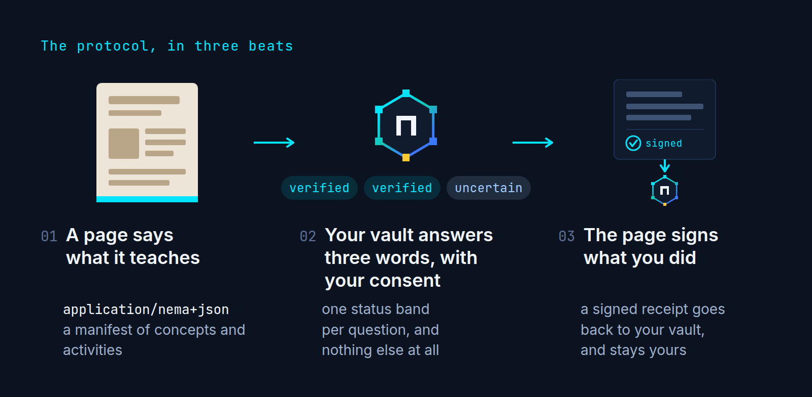

<p align="center">
  
</p>

<p align="center"><code>your learning state, everywhere.</code></p>

<p align="center">
  <b>Learn it once. It counts everywhere.</b>
</p>

<p align="center">
  Learn something on one site, and the next one already knows.<br>
  You decide what gets shared, every time.
</p>

<p align="center">
  
</p>

<p align="center">
  Your learning is scattered across the web: a course here, an article there, a<br>
  video somewhere else. nema keeps it in one place you own, and your agent uses<br>
  WebMCP to connect that place to every page you learn from.
</p>

<p align="center">
  <b>The web teaches. Your vault remembers. Your agent connects the two.</b>
</p>

<p align="center">
  nema is a protocol anyone who teaches on the web can install in a minute,<br>
  so every reader keeps what they learned.
</p>

---

## What it is

nema is a WebMCP protocol for learning, plus the pages that implement it.

1. A **vault** you own holds signed evidence of what you have learned and
   derives your state from it, per concept, per ability.
2. A **site that teaches** publishes what it teaches, what it assumes, and what
   evidence each activity produces, as tools on its own page. A course site
   writes that by hand; a blog installs it with one manifest block and one script
   tag and needs no backend at all.
3. Your **agent** is whichever one you already use: ChatGPT desktop, Chrome 149
   or later, Claude Code or Codex over MCP. It asks the site what it needs, asks
   the vault for a signed, audience-bound answer, and carries the result across
   origins. With no agent, the pages carry the same actions as buttons.
4. **You** approve every disclosure in a modal, and you answer every question.
   No tool can do either for you.
5. The payoff: a 68 minute course on pan sauces becomes 27, then 21, and a
   second cooking site recognises prerequisites it never taught, with no
   partnership between the two.

**The vault has a learner model, and the ideas in it are not ours.** It follows
the principles of learning fast that Justin Skycak writes up at
[justinmath.com](https://www.justinmath.com/the-pedagogically-optimal-way-to-learn-math/)
and that Kris Abdelmessih collects in
[The Principles of Learning Fast](https://moontowermeta.com/the-principles-of-learning-fast/).
Three of them are visible in `shared/inference.js`. Knowledge is hierarchical,
so a passed claim credits every prerequisite at a fraction and extends its
stability as half a pass, which is Math Academy's Fractional Implicit
Repetition and the reason review costs less the harder you work. Learning
happens at the edge of mastery, so the vault asks for a concept only when its
prerequisites are usable, and otherwise names the weakest prerequisite and the
goal it is blocking. Practice interleaves, so a session never puts two needs on
one concept next to each other and keeps confusable concepts apart unless
telling them apart is the point. `docs/PHILOSOPHY.md` argues the case;
`docs/SPEC.md` has the formulas.

**Sites speak their own names.** The concept registry is the anchor and it is
closed, but a site that already calls something `sugar-browning` is not asked to
rename its material to join. When the vault meets a name it does not know, the
agent proposes what it means, with one sentence saying why, and the learner
confirms or rejects it in the vault. Only a confirmed alignment translates
anything, and it translates at the vault's edges: a receipt written in a site's
names counts toward the registry concept, and a requirement asked in those names
is answered in the site's own words. Nothing signed is ever rewritten, so
confirming an alignment moves bands by changing how the vault reads its ledger
and rejecting one moves them back. A site may also declare its own vocabulary in
its manifest, which arrives confirmed on the site's word.

**A site can talk to the vault by itself.** No agent, no extension, only the
browser: "Connect your vault" opens the vault's own `/connect.html` in a small
popup with the request in the hash, the learner answers in the same consent
modal the vault page uses, and the token is posted back to the page that asked,
addressed to that origin and no other. It is a popup rather than an iframe
because a popup is a top level window on the vault's origin, so it reads the
learner's real vault; Chrome partitions third party iframe storage, which would
have given every site an empty one. The same window keeps a receipt after a
pass. Whichever route a person takes, the consent modal and the ledger are the
same.

## Live

| App | URL | Tools |
|---|---|---|
| Site (hub) | https://nema.migarci2.dev | `explain_nema` |
| Vault | https://nema-vault.migarci2.dev | 11 imperative + 1 declarative form (12 in `getTools()`) |
| Saucier School (provider) | https://saucier.migarci2.dev | 5 imperative + `present_assertion` (declarative), 6 in `getTools()` |
| Line Cook Lab (provider) | https://linecook.migarci2.dev | 5 imperative + `present_assertion` (declarative), 6 in `getTools()` |
| Maillard, explained (a blog) | https://maillard.migarci2.dev | the same 5 imperative + `present_assertion`, from the embed, with no server |
| AES-GCM, compared | https://aesgcm.migarci2.dev/compare | frereit's article, CC BY-SA 4.0, beside the nema version. The nema copy is a teaching page: the same 5 + the form |
| CPU chapter, compared | https://cpu.migarci2.dev/compare | Lexi Mattick's chapter, MIT, beside the nema version. The nema copy is a teaching page: the same 5 + the form |
| The embed | https://nema.migarci2.dev/nema-provider.js | source in `shared/provider-embed.js` |

There is no nema agent. The agent is the reader's own, and every flow also works
with no agent at all.

Judges: start with [`docs/JUDGE_GUIDE.md`](docs/JUDGE_GUIDE.md). It is a four
step walkthrough, with an agent or by hand, with the exact tool names and a list
of things to try to break.

## Bring your own agent

The vault is the infrastructure, and nema does not require its own agent. The
same eleven imperative vault tools reach it over two transports: browser agents
through WebMCP, and Claude Code and Codex through MCP. The browser vault also
exposes one declarative form.

| agent | transport | how |
|---|---|---|
| ChatGPT desktop | WebMCP | open https://nema-vault.migarci2.dev, the tools are on the page |
| Chrome 149+ with an agent | WebMCP | `chrome://flags/#enable-webmcp-testing`, then the same URL |
| Claude Code | MCP over stdio | `claude mcp add nema -- node /path/to/nema/packages/nema-mcp/bin.mjs` (this repo ships a project `.mcp.json`, so opening it in Claude Code is enough) |
| Codex | MCP over stdio | `codex mcp add nema -- node /path/to/nema/packages/nema-mcp/bin.mjs` |
| No agent | none | "Share with a site" in the vault, "Paste an assertion" on the site, "Send to vault" on the receipt |

[`packages/nema-mcp`](packages/nema-mcp/README.md) boots the browser vault
inside Node with four shims and exposes `tools.js` verbatim. Consent goes
through MCP elicitation, or through a pre-approval the learner sets from a
shell. The vault file (`~/.nema/vault.json`) has the same schema as the
browser one and merges by receipt id.

## nema in your browser (Chrome extension)

The same vault as a Chrome side panel, with a broker that needs no model. There
is nothing to copy. Chrome 116 or newer. ChatGPT desktop's browser does not run
extensions.

1. `bash scripts/build-extension.sh`
2. Open `chrome://extensions`, turn on Developer mode, click Load unpacked and choose `packages/nema-extension/dist`.
3. Pin the nema icon and click it: the vault opens in the side panel. Click "Load the demo learner".
4. Open https://saucier.migarci2.dev. A bar appears at the bottom of the page, "This site works with nema. Share what you already know?", and the panel reads "Saucier School asks about 5 things you may already know" with each one in plain words.
5. Click **Review request**, then **Approve**: the course rebuilds its path from 68 minutes to 27.
6. Answer "Which vinaigrette holds" in the page. The receipt is collected with nothing to copy, and the page shows a toast: "Kept in your vault: ratios, now usable".

Reload any tab that was open before you loaded the extension. Its own test: `CHROME=<chrome> node packages/nema-extension/test/e2e.mjs`.

## Architecture

Seven origins. No shared database, no accounts, no server that sees both sides.

```
            the reader's own agent: ChatGPT desktop, Chrome 149+,
            Claude Code or Codex over MCP, or nobody at all
                            |
                 tool calls over WebMCP, on the page that owns the data
                            |
              +-------------+-------------+
              v                           v
        +-----+----------------------+  +-+------------------------------+
        |  vault      (learner)      |  |  a site that teaches           |
        |                            |  |  Saucier School, Line Cook Lab |
        |  evidence ledger (signed)  |  |  or any page with the embed    |
        |  derived bands per ability |  |                                |
        |  disclosure ledger         |  |  LearningManifest              |
        |  consent modal (human)     |  |  activities + graders          |
        |  Share with a site         |  |  issuer key, or a self key     |
        +----------------------------+  +--------------------------------+

   objects on the wire, carried by the agent, or pasted by the human

     site   --  LearningManifest ------------------->  agent
     site   --  ReadinessRequest -------------------->  vault
     vault  ==  ReadinessAssertion  (signed, audience bound, 30 min)  ==>  site
     site   ==  EvidenceReceipt     (signed by the site's key)        ==>  vault
     vault  --  LearningNeed  (rubric attached) ------>  agent  -->  the learner

     ==  signed compact token:  nema1.<b64url payload>.<b64url signature>
     --  plain JSON tool result
```

The vault never sends history. The site never reads the vault. The agent never
writes state.

**Concept alignment** is one more array in the vault document, `alignments`, and
no change anywhere else. A record points one origin's local id at one registry
id with a relation and a status; `shared/inference.js` never sees it. Derivation
runs over a translated view of the ledger in which every confirmed local claim
is read as its registry concept and every unconfirmed one is left out, which is
why a decision moves bands with no write to the evidence. Two tools reach it,
`propose_concept_alignment` and `get_concept_alignments`, and there is no third:
confirming is the learner's judgement, so it exists only as a button in the
vault page and the extension panel.

**The connect handshake** is `shared/vault-link.js` on the site side and
`apps/vault/public/connect.html` on the vault side.
`connectVault({ vault, request })` runs inside a click and opens
`<vault>/connect.html#request=<b64url>&return=<origin>`. The vault checks that
`return` equals `request.audience` and refuses otherwise, which is what stops a
page from opening the window with somebody else's request, then runs the same
consent modal and the same `createAssertion` as the vault page and posts the
token back with `targetOrigin` set to the audience, never `'*'`.
`sendReceiptToVault` is the same window carrying a receipt the other way. The
module has no imports, resolves nothing against the page, and never signs,
verifies or reads storage.

## For creators

Any page that teaches something can join. One manifest block and one script tag,
no backend, no account:

```html
<script type="application/nema+json">
{ "protocol": "nema/0.1",
  "provider": { "name": "Maillard, explained" },
  "unit": { "id": "maillard-explained", "title": "Why browning tastes like that", "estimatedMinutes": 8 },
  "requirements": [ { "concept": "nema:heat-control", "ability": "explain" } ],
  "activities": [
    { "id": "read", "type": "lesson", "title": "Read the article", "minutes": 6,
      "outcomes": [ { "concept": "nema:maillard-reaction", "ability": "recognize" } ] },
    { "id": "check", "type": "quiz", "title": "Two questions before you go", "minutes": 2,
      "outcomes": [ { "concept": "nema:maillard-reaction", "ability": "explain" } ],
      "questions": [ { "id": "q1", "prompt": "...", "options": [ { "id": "a", "text": "..." } ], "answer": "a" } ] }
  ] }
</script>
<script type="module" src="https://nema.migarci2.dev/nema-provider.js"></script>
```

The script registers the same five imperative provider tools plus the
declarative `present_assertion` form, renders one quiet block in your own fonts and colours,
grades the quiz in the page, and signs each receipt with a key it generates in
the reader's browser. Those receipts are self certified: a vault verifies them,
labels them `self` and caps their weight at the `self-report` weight, 0.3. Two
optional upgrades earn full weight: `data-endpoint="/api/receipt"` to sign on
your own server, or publishing that key at `/.well-known/nema-issuer.json`.

Field by field, with the trust tiers: https://nema.migarci2.dev/creators.html.
A working example, whose source is the template:
https://maillard.migarci2.dev.

## Quick start

Node 20 or later and wrangler 4. No dependencies to install beyond wrangler.

```bash
npm install          # wrangler only
npm test             # node --test "test/**/*.test.js"
npm run build        # dist/<app> = apps/<app>/public + shared
npm run dev          # four wrangler dev servers: site, vault, and the two courses
```

Run the tests through `npm test`. `node --test test/` is not equivalent on
Node 22 and later: it treats the directory argument as a single test file and
fails. If you want the raw runner, use `node --test "test/**/*.test.js"` or
`node --test test/*.test.js`.

`npm run dev` starts the four servers the golden path needs. The other three are
started one at a time with `bash scripts/dev-restart.sh <app>`.

| App | Dev port |
|---|---|
| site | http://localhost:8780 |
| vault | http://localhost:8781 |
| harness (Saucier School) | http://localhost:8782 |
| security (Line Cook Lab) | http://localhost:8783 |
| blog (Maillard, explained) | http://localhost:8785 |
| aesgcm (AES-GCM, compared) | http://localhost:8786 |
| cpu (CPU chapter, compared) | http://localhost:8787 |

Native end to end tests ran on Chrome for Testing 154. nema targets WebMCP
enabled Chrome 149+ (`chrome://flags/#enable-webmcp-testing`, set to Enabled,
then restart) and ChatGPT's in app browser. Other browsers use the bundled
Chrome Labs polyfill for a degraded demonstration; the header pill on each page
tells you which path is live and how many tools are registered.

`npm run seed` re-signs the demo learner fixture. It needs
`secrets/issuer-private-keys.json`, which is gitignored, so it is only useful if
you generate your own keys.

## Repo layout

```
nema/
  docs/
    CONTRACT.md        the implementation contract every module codes against
    PHILOSOPHY.md      why learning state belongs to the learner
    SPEC.md            protocol 0.1: objects, tokens, verification, inference
    THREAT_MODEL.md    threats, mitigations, and the honest limits of this demo
    JUDGE_GUIDE.md     four step walkthrough, what to break, real vs simulated
    DEVPOST.md         submission text
    VIDEO_SCRIPT.md    2:55 shot list
  shared/
    crypto.js          ECDSA P-256, base64url, sha256, compact tokens
    protocol.js        object builders, validators, token encode and verify
    inference.js       derive bands from receipts, compute learning needs
    webmcp.js          registerTool helper, tool activity events, live indicator
    webmcp-polyfill.js Chrome Labs polyfill (Apache-2.0)
    provider-embed.js  the manifest and script install, served as /nema-provider.js
    concepts.json      the nema: concept registry
    issuers.json       trusted issuer public keys
    origins.json       app origins, prod and dev
    brand/             tokens.css, brand.css, self-hosted fonts, wordmark, mark
  apps/
    site/              the hub, the creator guide and the presentation
    vault/             the learner's vault, 11 tools + 1 declarative form
    harness/           provider 1, Saucier School, "Pan Sauces and Emulsions", 5 tools + Worker
    security/          provider 2, Line Cook Lab, "Service Under Pressure", 5 tools + Worker
    blog/              one article, "Why browning tastes like that", installed with the embed
    aesgcm/            frereit's AES-GCM article mirrored under CC BY-SA 4.0, with and without nema
    cpu/               Lexi Mattick's CPU chapter mirrored under MIT, with and without nema
  scripts/             build.sh, dev.sh, deploy.sh, make-seed.mjs
  test/                crypto, protocol, inference, graders
```

One naming note, because it trips people up on first read. The two provider
apps live in `apps/harness` and `apps/security`, and the same two keys name
them in `shared/origins.json`, in `ORIGINS.harness` and `ORIGINS.security`, and
in the dev port table above. Those are internal identifiers, frozen so the
build, the deploy script and the tests do not churn. What the learner sees is
the provider's public identity: `apps/harness` is **Saucier School** at
https://saucier.migarci2.dev, and `apps/security` is **Line Cook Lab** at
https://linecook.migarci2.dev. Every name, unit and concept in the two example
courses is about cooking. The courses are examples of the protocol, not
descriptions of nema itself.

## Two identities on purpose

nema is a hub and a vault. It is not a course catalogue. So the example sites
do not wear nema's brand: they re-theme the shared components
in their own `app.css`, render their own header and wordmark, and carry one
discreet "Works with nema" badge that links back to the hub. Saucier School is
warm paper and a serif, a well made course site. Line Cook Lab is near black
and monospace, an ops tool for the pass. A judge should be able to tell at a
glance which surface belongs to the learner and which two are just the web.

## WebMCP integration

Every page loads the polyfill as a classic script in `<head>`, before any module
script, then registers tools with `document.modelContext.registerTool` exactly
as Chrome documents it. Here is a real one, from the vault:

```js
await document.modelContext.registerTool({
  name: 'stage_evidence_receipt',
  description:
    'Verify a signed nema evidence receipt and add it to the vault ledger. ' +
    'Shows the receipt in the evidence ledger and animates the learner state ' +
    'rows that changed. Returns the accepted claims and the band changes, or ' +
    'a rejection reason. Only bands are returned. Evidence history never ' +
    'leaves the vault.',
  inputSchema: {
    type: 'object',
    properties: {
      token: { type: 'string', description: 'Compact receipt token starting with nema1.' }
    },
    required: ['token'],
    additionalProperties: false
  },
  async execute({ token }) {
    const res = await verifyReceipt(token, ISSUERS, { seenReceiptIds: seenIds() });
    if (!res.ok && res.reason === 'unknown-issuer') {
      storePending(token, res.payload);
      return { status: 'pending', reason: 'unknown-issuer' };
    }
    if (!res.ok) return { status: 'rejected', reason: res.reason };
    const { changes, reviewsScheduled } = applyReceipt(res.payload, token);
    return {
      status: 'accepted',
      receiptId: res.payload.receiptId,
      issuer: res.payload.issuer,
      issuerName: issuerName(res.payload.keyId),
      activity: res.payload.activity,
      claims: res.payload.claims,
      changes,
      reviewsScheduled
    };
  }
});
```

Registration goes through `shared/webmcp.js`, which catches errors into
`{ error }` results instead of throwing and dispatches a `nema:toolcall` event
so every page can show a tool activity strip. The declarative form is
demonstrated too: the vault exposes `<form toolname="set_learning_goal_form">` and every teaching
page exposes `<form toolname="present_assertion">`, which is also the textarea a
person pastes into when no agent is present.

## Tool catalogs

**Vault**, 11 imperative tools. `get_vault_summary`, `get_learner_state`,
`set_learning_goal`, `create_readiness_assertion`, `stage_evidence_receipt`,
`get_learning_needs`, `record_agent_assessment`, `get_disclosure_ledger`,
`get_evidence_ledger`, `propose_concept_alignment`, `get_concept_alignments`.
Plus the declarative form `set_learning_goal_form`, so
`document.modelContext.getTools()` on the vault returns twelve.

**Providers**, 5 tools each, plus the declarative `present_assertion` form.
`describe_learning_offer`, `personalize_learning_path` (Saucier School) or
`check_prerequisites` (Line Cook Lab), `start_activity`, `get_attempt_status`,
`issue_evidence_receipt`. The blog registers the same five from the embed.

**Site**, 1 imperative tool on the hub home: `explain_nema`. The reference
pages under it (`/protocol.html`, `/philosophy.html`, `/judges.html`) also carry
a declarative `<form toolname="open_app">`.

Full input and output shapes are in [`docs/SPEC.md`](docs/SPEC.md), sections 7
and 8.

### Tools that do not exist

This list is part of the design, not an omission.

| name | why not |
|---|---|
| `set_mastery` | state is derived from signed evidence, never written |
| `get_full_history` | disclosure is per request and per audience, never bulk |
| `submit_answer_for_learner` | only the human answers, and grading runs server side |
| `disable_review` | the schedule is a property of the evidence, not a setting |
| `export_vault` | export is a button a human clicks, not an agent capability |

Verify it yourself: open any nema page and call
`await document.modelContext.getTools()`.

## Privacy and security

- **Minimal disclosure.** A `ReadinessAssertion` carries only the concepts that
  were requested, as bands, plus an audience, a purpose, a request hash and an
  expiry. No history, no scores, no other subjects, no review schedule.
- **Human gate.** `create_readiness_assertion` blocks on a consent modal that
  lists what is shared and what is withheld. Deny returns `{ status: 'denied' }`
  and writes nothing.
- **Audience binding.** Assertions are valid at one origin for 30 minutes. Reuse
  elsewhere fails with `wrong-audience`; late use fails with `expired`.
- **Per audience identity.** `learnerKeyId` is derived from the vault key and
  the audience, so two providers see different ids for the same learner.
- **Signed evidence only.** Receipts are ECDSA P-256 signed, deduplicated by
  `receiptId`, and labelled with how much the signature is worth: `registered`
  for a key in `shared/issuers.json`, `origin` for a key the issuer publishes at
  `/.well-known/nema-issuer.json`, `self` for a key the page generated itself.
  A `self` receipt is capped at the `self-report` weight, 0.3, whatever grader
  it declares, so a site can vouch for itself and only for itself. An unknown
  issuer lands in the ledger as `pending` and changes nothing, visibly.
- **Derived state.** Bands are recomputed from the ledger on every read, so
  everything the vault shows can be reproduced from the receipts.
- **Keys stay put.** Providers with a Worker sign there. No registered issuer
  private key is ever sent to a browser. The embed's self key never leaves the
  reader's browser and can only ever say "this page saw this reader do this".

Honest limits, including provider answer keys being visible in devtools and the
vault key living in `localStorage`, are written up in
[`docs/THREAT_MODEL.md`](docs/THREAT_MODEL.md), section 4.

## License

MIT. See [`LICENSE`](LICENSE).

## Credits

- WebMCP polyfill by Chrome Labs, Apache-2.0. Vendored at
  `shared/webmcp-polyfill.js` with its license header intact.
- Fonts, all SIL Open Font License and self-hosted: Pixelify Sans, Inter,
  JetBrains Mono. The notice is at `shared/brand/fonts/OFL.txt`.
- "AES-GCM and breaking it on nonce reuse" by frereit, republished under
  CC BY-SA 4.0 with attribution and a change notice in
  [`apps/aesgcm/LICENSE.article`](apps/aesgcm/LICENSE.article).
- "The Basics", chapter 1 of "Putting the You in CPU" by Lexi Mattick,
  republished under the MIT licence with attribution and a change notice in
  [`apps/cpu/LICENSE.article`](apps/cpu/LICENSE.article). That copy also has
  the analytics script removed and its links adjusted, as disclosed on the page.
- Everything else in this repository is original work by the author, MIT
  licensed. The root MIT licence does not cover the two mirrored articles.

---

Built for **The WebMCP Challenge**. Everything here was created during the
submission period, 25 August to 4 September 2026; the commit history is the
evidence. No prior work was reused, apart from the two third party items
credited above.
