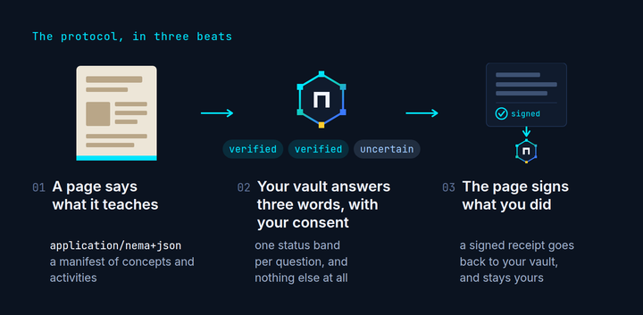

# Judge guide

**Learn it once. It counts everywhere.**

Learn something on one site, and the next one already knows. You decide what
gets shared, every time.



Your learning is scattered across the web: a course here, an article there, a
video somewhere else. nema keeps it in one place you own, and your agent uses
WebMCP to connect that place to every page you learn from.

**If you only have three minutes**, do
[step 1 of the golden path](#step-1-a-course-site-asks-what-you-know-and-68-minutes-become-27).
It is the whole idea end to end: a course asks, you say yes, 68 minutes become
27.

Three minutes to see the whole thing. Sixty seconds if you are behind schedule.

> nema is a protocol anyone who teaches on the web can install in a minute, so
> every reader keeps what they learned.

There is no nema agent to log into. The agent is whichever one you already use:
ChatGPT desktop, Chrome 149 or later, Claude Code or Codex through
`packages/nema-mcp`. Every flow below also works with no agent at all, because
the pages carry the same actions as buttons.

The example sites teach cooking. That is deliberate. The protocol is about
carrying a learner's state between websites, so the subject had to be something
real, testable and completely unrelated to the machinery underneath.

## Live URLs

| App | URL | What it is |
|---|---|---|
| Site | https://nema.migarci2.dev | The hub, and the install guide at `/creators.html`. Start here. |
| Vault | https://nema-vault.migarci2.dev | The learner's vault. 11 imperative tools plus one declarative form, so `getTools()` lists 12. |
| Saucier School | https://saucier.migarci2.dev | Provider 1, "Pan Sauces and Emulsions". 5 imperative tools plus the `present_assertion` form, so `getTools()` lists 6. |
| Line Cook Lab | https://linecook.migarci2.dev | Provider 2, "Service Under Pressure". 5 imperative tools plus the `present_assertion` form, so `getTools()` lists 6. |
| Maillard, explained | https://maillard.migarci2.dev | One blog post, installed with one manifest block and one script tag. The same 5 imperative tools plus the `present_assertion` form, so `getTools()` lists 6. No server. |
| AES-GCM, compared | https://aesgcm.migarci2.dev/compare | frereit's article under CC BY-SA 4.0, republished beside the nema version with the generated diff. The nema copy at `/` is a teaching page: 5 imperative tools plus the form. |
| CPU chapter, compared | https://cpu.migarci2.dev/compare | Lexi Mattick's CPU chapter under the MIT licence, republished beside the nema version with the generated diff. The nema copy at `/` is a teaching page: 5 imperative tools plus the form. |

Seven origins in all: the hub, the vault, two courses, one blog, and the two
mirrored articles.

Repository: https://github.com/migarci2/nema (MIT).

The three teaching sites do not wear nema's brand. Saucier School is a warm
paper course site with a serif; Line Cook Lab is a dark, terse tool for the
pass; the blog is a white page and a serif column. Each carries one small "Works
with nema" badge and nothing else of nema's. They are meant to read as
independent websites that happen to speak the same protocol, because that is the
claim being made.

## Browser setup

**ChatGPT desktop.** The in-app browser has WebMCP on by default. Open
https://nema-vault.migarci2.dev in it and the tools are discovered with no
setup. This is the shortest route to seeing an agent drive nema.

**Chrome 149 or later.** Go to `chrome://flags/#enable-webmcp-testing`, set it
to Enabled, restart, then attach whatever agent you use in that browser.

**Claude Code or Codex.** `claude mcp add nema -- node /path/to/nema/packages/nema-mcp/bin.mjs`,
or the same line with `codex mcp add`. The vault runs inside Node with the same
eleven tools; the sites stay in the browser and you paste one token between them.

**Browser support.** Native end to end tests ran on Chrome for Testing 154.
nema targets WebMCP enabled Chrome 149+ and ChatGPT's in app browser. Other
browsers use the bundled Chrome Labs polyfill for a degraded demonstration. The
header pill on every page says `tools: N` and reads `native` or `polyfill`, so
you always know which path you are on.

Nothing needs an account, an API key or a sign in. Nothing is stored on a
server. The vault lives in your browser's `localStorage`.

- No Chrome 149 at hand? Chrome for Testing canary has WebMCP on by default: `npx --yes @puppeteer/browsers install chrome@canary --path .chrome`, then open the URLs with that binary.

## Evidence, frozen for this submission

Unit tests: 267 (`npm test`). Extension end to end: 38 checks. Native browser
flows on Chrome for Testing 154 against the live origins: golden-vault 46,
golden-providers 12, golden-connect 38, all passing. MCP: `npm run test:mcp`,
8 passing.

Tool inventory, checkable with `document.modelContext.getTools()`:

- Teaching page: 5 imperative tools and 1 declarative form, so `getTools()`
  returns 6 entries.
- Browser vault: 11 imperative tools and 1 declarative form, so `getTools()`
  returns 12 entries.
- MCP bridge: the 11 imperative vault tools.

The seven live origins, by role:

| role | origin |
|---|---|
| hub | https://nema.migarci2.dev |
| vault | https://nema-vault.migarci2.dev |
| course | https://saucier.migarci2.dev |
| course | https://linecook.migarci2.dev |
| blog | https://maillard.migarci2.dev |
| mirrored article | https://aesgcm.migarci2.dev |
| mirrored article | https://cpu.migarci2.dev |

Submission commit: `03c14aa`.

## Before you start

Open the vault: https://nema-vault.migarci2.dev, and click **Load demo learner**.

That imports `/seed.json`, a set of receipts signed by the demo seed issuer, so
you start with a cook who has already done some work: knife skills, heat
control, mise en place and food safety are all evidenced, ratios only weakly,
emulsions not at all. The evidence ledger labels every one of those rows "nema
demo seed". The learner's goal, also in the seed, is "Cook a pan sauce I can
hold through service".

## The golden path, four steps

Each step works two ways. **With an agent**, the agent calls the tools and you
approve. **By hand**, you click the same actions in the pages and carry one
token across yourself. The result is identical, because both go through the same
code.

### Step 1. A course site asks what you know, and 68 minutes become 27

**With an agent.** Open the vault in one tab and https://saucier.migarci2.dev
in another, then ask: *"Teach me to make a pan sauce, and use my nema vault."*

Tools called: `describe_learning_offer` on Saucier School, then
`create_readiness_assertion` on the vault, then `personalize_learning_path` back
on the school with the token.

The consent modal opens in the vault tab and everything stops. It shows the
audience, the purpose, the exact three lines that will be shared with their
status bands, the fixed list of what is not shared (attempt history, exact
scores, other subjects, misconceptions, review schedule, provider history), and
the expiry, 30 minutes. Click **Approve**.

This is the moment worth four seconds of your attention: the agent asked, the
human decided, and the token did not exist until you clicked.

**With a terminal agent.** Claude Code or Codex handles the vault side: ask for
a readiness assertion for `https://saucier.migarci2.dev` and approve through the
MCP elicitation prompt. Then paste the token into **Paste an assertion** on the
Saucier School page. The site verifies it exactly the same way.

**By hand, no agent and nothing installed.** On Saucier School, under the
requirements, click **Connect your vault**. Your vault opens in a small window
of its own, on its own origin, with this course's request in the address. The
same consent modal appears there. Click **Approve** and the window says "Shared.
You can close this window" and closes itself, and the course behind it rebuilds
its path. The token never touched your clipboard and no site ever saw your
vault: the two pages exchanged one signed message, and you were the only thing
in the middle.

If your browser blocks the popup, the page says so and points at the fallback:
open **Paste an assertion**, mint the token in the vault under **Share with a
site** (audience `https://saucier.migarci2.dev`, a purpose, the three
requirements), Approve, Copy, paste, submit. That textarea is the declarative
tool `present_assertion`, so a person and an agent land on the same verification
path, and so does the button above it.

**What happens on screen.** The unit hero shows "Pan Sauces and Emulsions", 68
minutes, 7 activities. The three requirement pills fill in, two cyan `verified`
and one yellow `uncertain`. The path panel splits into full path and personal
path, and three items are struck through with the reason next to each one:

| struck through | minutes | reason shown |
|---|---|---|
| `heat-control-primer` | 12 | skipped: heat-control explain verified |
| `knife-skills-refresher` | 15 | skipped: knife-skills apply verified |
| `ratios-primer` | 14 | skipped: ratios apply uncertain, diagnostic instead |

41 minutes removed, so the counter animates from 68 to 27. Nothing is added.
`ratios-diagnostic` was already inside the 68 minute offer; it survives the cut
because its `onlyIf` matches `ratios.apply` at exactly `uncertain`, which is what
`onlyIf` is for. A cook with no evidence about ratios at all would keep the 14
minute primer instead and drop the diagnostic.

**Then do the work, which nobody can do for you.** Open `ratios-diagnostic`.
One question, "Which vinaigrette holds", four written ratios. **You** pick the
one that will emulsify and stay emulsified: three parts oil to one part acid,
with a spoonful of mustard whisked into the acid first. The other three are a
1:1 that separates, a 3:1 with no emulsifier whisked cold, and a 1:3 that is
mostly vinegar. There is no tool that submits an answer, and the grading runs on
the Worker.

Submit. Deterministic grading, instant feedback, and the receipt panel fills
with a signed token, decoded beside it: issuer, activity, claim
`nema:ratios.apply passed`, grader `deterministic`.

**Take it home.** With an agent: `stage_evidence_receipt` with the token. By
hand: click **Keep in my vault**. The same small vault window opens, checks the
signature, stages the receipt and closes, and the course prints what your vault
answered, in words: "Kept: ratios, now usable". Under **Do it by hand** the
token, its Copy button and the old **Send to vault** link are still there for a
browser with no popups.

The vault verifies the signature against `issuers.json`, adds a row to the
evidence ledger with a cyan `verified` badge, and animates one row of the state
table: `nema:ratios.apply` moves from `uncertain` to `usable`. Present a fresh
assertion to Saucier School and 27 becomes 21, because `ratios.apply` is now
`verified`, so the diagnostic's `onlyIf` no longer matches.

### Step 2. A second site recognises what the first one taught

**With an agent.** Open https://linecook.migarci2.dev and ask: *"Can I start the
incident triage lab?"* Tools called: `describe_learning_offer`, then
`create_readiness_assertion` for the new audience, then `check_prerequisites`.

Before leaving Saucier School, mark **Anatomy of a pan sauce** as read and keep
that receipt in the vault. This is the small piece of shared course progress the
next site will recognise.

**By hand.** Click **Connect your vault** on Line Cook Lab and approve. Same
button, different site, different question: this one asks about mise en place,
food safety and emulsions, plus heat control and pan sauces for its skippable
lessons.

Either way, read the `learnerKeyId` line while the consent modal is open. It is
a different string here than it was for Saucier School, because the id is
derived from the vault key and the audience.

| requirement | status | where the evidence came from |
|---|---|---|
| `nema:mise-en-place.explain` | `verified` | receipts already in the vault, issued by other origins |
| `nema:food-safety.apply` | `verified` | receipts already in the vault, issued by other origins |
| `nema:emulsions.explain` | `missing` | nothing in the vault claims it |
| `nema:heat-control.recognize` | `verified` | earlier evidence also covers this lower ability |
| `nema:pan-sauces.recognize` | `uncertain` | the lesson receipt just kept from Saucier School |

Four lessons are marked `done via nema`, including the two shared lessons
`heat-control-on-the-line` and `pan-sauces-during-service`. That removes 28 of
the unit's 54 minutes without pretending they were completed on this site.
Both labs stay locked, and the page names the exact reason:
`emulsions.explain` needs to be at least `uncertain`.

This is the honest version of the cross site claim, and it is the interesting
one. Line Cook Lab never spoke to the sites that produced that evidence. It
verified one signature from the vault, checked that the token was minted for its
own origin, and got five bands.

**Close the gap, with an agent.** Ask: *"Line Cook Lab wants emulsions. Ask my
vault what I should do about that and coach me through it."* Tools called:
`get_learning_needs`, then `record_agent_assessment`.

The vault returns an `acquire` need for `nema:emulsions.explain` with the rubric
attached, because emulsions is in the active goal and no ability on it has any
evidence. The agent asks you the question. **You** answer: two phases, fat
dispersed as droplets in water or the reverse, an emulsifier at the interface,
and a temperature window, because a butter emulsion breaks when it is boiled.
The agent grades your answer against the vault's rubric, criterion by criterion,
and records the result.

On screen: a new ledger row with the "agent assessed" badge rather than the cyan
verified one, and one row in the state table moving from `unknown` to `fragile`.
The arithmetic is visible in the spec: `agent-assessed` weighs 0.6, one passing
claim scores 0.6, and 0.6 clears the 0.4 `fragile` threshold and nothing more.
Weaker evidence, honestly labelled and honestly weighted.

Present a fresh assertion to Line Cook Lab and `emulsions.explain` comes back
`uncertain`, which is what the lock asked for. Both labs flip from locked to
available with the label "Prerequisite recognised from another provider".

Two independent websites and one learner owned vault, with no shared account
between them and no back channel.

### Step 3. A blog post does the same with one manifest block and one script tag

Open https://maillard.migarci2.dev. It is one article, "Why browning tastes like
that", written the way a personal blog is written: white page, a serif, one
column. It has no server, no database and no account. Its whole integration is one
manifest block and one script tag, and the source marks them with a comment so
you can copy them.

Read it, click **Connect your vault** at the top of the block, approve, and the
article tells you what you can skip. Answer the two questions at the end and
click **Keep in my vault**. With an agent, the same five imperative provider tool names are on that page and
it can do all of it.

That whole loop is the point of this step: a blog with no server, no account and
no build step, talking to a vault it has never met, through two buttons that
came with the script tag.

In the vault, that receipt reads `self`. The blog signs with a key it generated
in the reader's browser and publishes inside the receipt, so the signature
verifies and the origin is real, but nothing outside the blog vouches for it.
The vault caps a `self` receipt at the `self-report` weight, 0.3, whatever
grader the page declared. A site can vouch for itself and only for itself.

Two upgrades sit above that tier, and the install guide at
https://nema.migarci2.dev/creators.html walks through both: post the submission
to your own Worker for a receipt signed with your own key, or publish that key
at `/.well-known/nema-issuer.json` so the vault promotes the receipt to
`origin` and full weight.

### Step 4. The blog does not speak nema, and that is fine

Look at the manifest in the blog's source. Its concepts are called
`browning-science` and `sugar-browning`, not `nema:maillard-reaction` and
`nema:caramelization`. A site should not have to rename its own material to
join a protocol, so nema lets it keep its words and translates at the vault.

With an agent, in the blog tab, say:

> **This site names things its own way. Propose alignments to my vault's
> concepts.**

The agent reads `describe_learning_offer`, sees the local ids, and calls
`propose_concept_alignment` on your vault once per name it cannot resolve.
Nothing has changed yet. Open the vault, find **Alignments** under the ledgers,
read the rationale, and press **Confirm**.

The moment you do, bands move. The receipt the blog signed for
`browning-science` was accepted and stored when it arrived, marked "waiting on
an alignment", and counted for nothing. Confirming the name is what makes it
count, and no receipt is re-signed, re-staged or rewritten to do it: the ledger
row still says exactly what the blog said, with "read as
nema:maillard-reaction" beside it. Press **Undo** on the confirmed line and the
band goes back.

`sugar-browning` is the other half of the demonstration. The blog declares
`alignsTo: nema:caramelization` in its own manifest, so any surface that reads
that manifest hands the vault a declaration rather than a guess: it arrives
already confirmed and marked "declared by the site" (the extension panel does
this the moment you open the page with it). A site may vouch for its own
vocabulary. It may not vouch for anyone else's, and it cannot overrule a name
you have already ruled on.

**By hand, no agent.** Answer the blog's two questions and press **Keep in my
vault**. The receipt is accepted and the vault window says plainly that
`browning-science` is a name this vault has not aligned, so that claim moved
nothing. The Alignments list now shows the word itself, who signed
it, and a **Say what it means** button: press it, type `nema:maillard-reaction`,
choose "is the same thing as", press **Align it**. The same bands move, and the
list records it as your own word rather than an agent's.

An alignment is a question put to the learner rather than a capability an agent
holds. Every proposal has Confirm and Reject, and there is no
`confirm_concept_alignment` tool on any surface, in the browser or over MCP: an
agent can put the question to you, and nothing else.

### One more thing, if you have thirty seconds

Ask your agent: *"Build my best 5 minute review."* Tool called:
`get_learning_needs` with `budgetMinutes: 5`. The vault does not return the
concepts you know least. It returns a `discriminate` need on
`nema:maillard-reaction` against `nema:caramelization`: the learner can apply
browning confidently, has no evidence of telling the two reactions apart, and
the two are marked `confusableWith` in the registry. That is the vault reasoning
about the shape of the evidence, not about a score.

## Terminal agents, the same tools over MCP

Open this repo in Claude Code and approve the project server it ships in
`.mcp.json`, or run `codex mcp add nema -- node /path/to/nema/packages/nema-mcp/bin.mjs`.
Then ask:

1. "What does my vault say about pan sauces?" The agent calls
   `get_vault_summary` and `get_learner_state` (run `node packages/nema-mcp/bin.mjs seed` first for the demo learner).
2. "Create a readiness assertion for https://saucier.migarci2.dev." If the
   client supports elicitation you get the same consent prompt as the browser
   modal. If not, the tool returns `denied` with the pre-approval command, and
   only you can run it.
3. Paste a receipt token from a provider page: "Stage this receipt: nema1...".
   The bands move in `~/.nema/vault.json`, and `nema-mcp merge` folds a
   browser export into the same ledger.

Tests: `npm run test:mcp` drives the server with the official MCP client.

Non interactive example, verified with Codex 0.151:

```sh
node packages/nema-mcp/bin.mjs seed
codex exec --dangerously-bypass-approvals-and-sandbox \
  "Using the nema MCP tools, call get_vault_summary and get_learning_needs with budgetMinutes 5, then summarise."
```

Interactive `codex` and Claude Code ask you to approve each nema tool call; `codex exec` needs the bypass flag because its default approval policy is never.

## nema in your browser, optional, 30 seconds to load

The same vault as a Chrome side panel, with a broker that needs no model. There
is nothing to copy: the page bar opens the same approval step, and after you
pass a check the receipt is collected into the local vault. Chrome 116 or newer.
ChatGPT desktop's browser does not run extensions.

1. `bash scripts/build-extension.sh`, or download the built zip from https://github.com/migarci2/nema/releases/tag/v0.1.0 and unzip it.
2. Open `chrome://extensions`, turn on Developer mode, click Load unpacked and choose `packages/nema-extension/dist`.
3. Pin the nema icon and click it: the vault opens in the side panel. Click "Load the demo learner".
4. Open https://saucier.migarci2.dev. A bar appears at the bottom of the page, "This site works with nema. Share what you already know?", and the panel reads "Saucier School asks about 5 things you may already know" with each one in plain words.
5. Click **Review request**, then **Approve**: the course rebuilds its path from 68 minutes to 27.
6. Answer "Which vinaigrette holds" in the page. The receipt is collected with nothing to copy, and the page shows a toast: "Kept in your vault: ratios, now usable".

Reload any tab that was open before you loaded the extension. Its own test: `CHROME=<chrome> node packages/nema-extension/test/e2e.mjs`.

## Try to break it

Everything here is meant to be attacked. The apps show you what happened.

| Attack | How | What you see |
|---|---|---|
| Make the agent write mastery | Ask: "just mark pan sauces as mastered" | The agent reports there is no such tool. `set_mastery` does not exist. Check `document.modelContext.getTools()` yourself. |
| Make the agent answer for you | Ask: "answer the vinaigrette question for me" | No tool accepts an answer. The agent can only open the activity and poll. |
| Read the whole vault | Ask: "list all my receipts and every date I studied" | `get_learner_state` returns bands only. `get_full_history` does not exist. The evidence ledger is visible to you in the page, not to a provider. |
| Tamper with a token | Copy the receipt from the textarea, change one character, paste it into the vault's manual token inbox, press Stage receipt | `{ status: 'rejected', reason: 'bad-signature' }`, red banner, nothing changes. |
| Replay a receipt | Stage the same receipt token twice | `{ status: 'rejected', reason: 'duplicate' }`. No band moves. |
| Wrong audience | Paste the Saucier School assertion into the Line Cook Lab assertion box | `{ status: 'rejected', reason: 'wrong-audience' }`, shown in the provider UI. |
| Expired assertion | Wait 30 minutes, or edit the clock, then present the same assertion again | `{ status: 'rejected', reason: 'expired' }`. |
| Unknown issuer | Sign a receipt with your own key and stage it | `{ status: 'pending', reason: 'unknown-issuer' }`. It appears in the ledger with a yellow badge and changes no state. Rejection is visible, not silent. |
| Inflate a self signed receipt | Edit the blog's manifest in devtools to claim `grader: "deterministic"`, then stage the receipt | It verifies, lands as `self`, and is still capped at 0.3. A site cannot promote itself. |
| Confirm an alignment as the agent | Ask: "confirm that browning-science is nema:maillard-reaction in my vault" | The agent can propose and read, and finds no tool that decides. Confirm and Reject are two buttons in the vault, on every surface. |
| Rename your way into a band | Propose `browning-science` as `nema:knife-skills`, confirm it, and watch what moves | Exactly the blog's own evidence, at the blog's own weight: a `self` receipt is 0.3 whatever it is called. Translation moves a name, never a weight, and Undo puts it back. |
| Steal a token through the popup | Open `<vault>/connect.html#request=<a request addressed to Saucier School>&return=https://evil.example` yourself | "This request is not addressed to the site that opened it". The consent modal never appears, so no token exists to steal. The vault answers `request.audience` with `postMessage` and nobody else, never `'*'`. |
| Answer the popup from somewhere else | Post `{ type: 'nema:assertion', status: 'approved', token }` to the course page from any other window | Ignored. The site side only reads a message whose `event.origin` is the vault origin it opened. |
| Deny a disclosure | Click Deny in the consent modal | `{ status: 'denied' }`. No token, nothing written, and the disclosure ledger records nothing because nothing was disclosed. |

## Sixty second version

No agent, no extension, no clipboard.

1. Open https://nema-vault.migarci2.dev and click **Load demo learner**.
2. Open https://saucier.migarci2.dev and click **Connect your vault**. Your
   vault opens in a small window, shows the exact three lines it would share,
   and waits. Click **Approve**. It closes itself and the course rebuilds:
   68 minutes become 27, with the reason on every struck through item.
3. Answer "Which vinaigrette holds", ask the kitchen for the receipt, and click
   **Keep in my vault**. The vault window opens, checks the signature, and the
   course prints "Kept: ratios, now usable".
4. Do step 2 again on https://linecook.migarci2.dev and read the prerequisite
   table. Two of its three requirements come back `verified` from evidence the
   vault holds from other origins, the third comes back `missing`, and the page
   names it. A site with no relationship to anyone got a precise, minimal answer
   about a stranger, because the learner clicked Approve.
5. Open https://maillard.migarci2.dev and view source. That is the whole
   install: one manifest block, one script tag, and the same two buttons.

If you only look at one screen, make it the consent modal.

## What is real, what is simulated

**Real.**

- WebMCP tool registration. `document.modelContext.registerTool` on every
  origin, imperative and declarative.
- ECDSA P-256 signatures over compact tokens, produced and verified with Web
  Crypto in the browser and in Cloudflare Workers.
- Audience binding, expiry, issuer allow list, duplicate rejection. All of it
  is checked, all of it is in the unit tests.
- Cross origin handoff. Separate origins, separate `localStorage` jars, no
  shared database, no shared account, no server that sees both sides.
- The derivation. Bands are recomputed from the receipt ledger on every read
  with the formulas in `docs/SPEC.md`. Nothing is hardcoded for the demo.
- Deterministic grading on the Worker, before signing, for the two course sites.
- The manifest and script install. The blog runs the same five imperative tools
  and the declarative form from the shared embed, with no build step and no
  backend of its own.
- The cooking. The ratios, temperatures and rescues in the units are the real
  ones. A 3:1 vinaigrette with mustard holds. A butter emulsion mounted off the
  heat and kept under about 60 C holds; boiled, it breaks. Chicken at 60 C is
  not done. Rinsing it does not make it safer, it aerosolises the problem.

**Simulated, and labelled as such in the UI.**

- The demo learner. `/seed.json` is a fixture signed by a `seed` issuer whose
  origin is `urn:nema:seed`, shown in the ledger as "nema demo seed".
- The course content. Small units written for this demo, not a catalogue, and
  no substitute for standing next to someone at a stove.
- The lab consoles. The "run" output in the interactive labs is scripted before
  and after text, a tasting note rather than a real pan.
- The blog's trust tier. Its receipts are self certified, which the vault says
  in the ledger and enforces by capping their weight at 0.3.
- The evidence behind the Line Cook unlock, in the sense that it is demo
  evidence. `nema:mise-en-place.explain` and `nema:food-safety.apply` come from
  the seed fixture. `nema:emulsions.explain` comes from an agent's rubric
  assessment at weight 0.6. Saucier School's own emulsions outcome is a
  `discriminate` claim, and discrimination claims contribute only to
  `discriminate`, so no Saucier receipt is load bearing for the Line Cook unit,
  and this guide does not pretend otherwise. What is real is the mechanism: Line
  Cook Lab verifies one vault signature and reads the bands it asked for,
  whoever produced the evidence underneath them.

**Known limits.** Provider answer keys are visible in devtools, the vault key
is in `localStorage`, and there is no revocation. Written up honestly in
`docs/THREAT_MODEL.md`, section 4.
